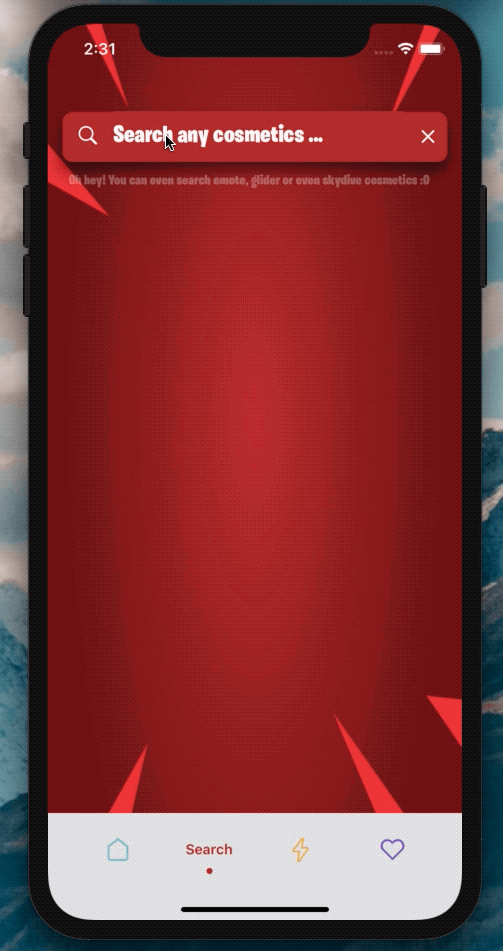

[](https://github.com/WrathChaos/react-native-button)

[](https://github.com/WrathChaos/react-native-dynamic-search-bar)

[](https://www.npmjs.com/package/react-native-dynamic-search-bar)
[](https://www.npmjs.com/package/react-native-dynamic-search-bar)


[](https://opensource.org/licenses/MIT)

<p align="center">
  <a href="https://freakycoder.com/react-native-library-dynamic-search-bar-c03fea9fae36">
    
  </a>
</p>

<table>
  <tr>
    <td align="center">
      
    </td>
    <td align="center">
    
    </td>
   </tr>
</table>

<h1 align="center"> Built-in Spinner </h1>
  <p align="center">
  
</p>

# Version 2.0 🥳

Version 2.0 is here 🥳

- Completely re-written from scratch 💪
- Much better coding for maintenance and less dependency
- 3 dependencies are removed 😱
- Better prop management and cool customizations are possible now
- Dark Mode integration 🌙

<i>I can't waiting to see what you're going to make with this `SearchBar` 😍</i>

## Installation

Add the dependency:

### React Native

```js
npm i react-native-dynamic-search-bar
```

### Expo Version

```js
npm i WrathChaos/react-native-dynamic-search-bar#expo
npm i WrathChaos/react-native-dynamic-vector-icons#expo
```

## Peer Dependencies

###### IMPORTANT! You need install them

```js
"react-native-animated-spinkit": "^1.4.1",
"@freakycoder/react-native-bounceable": ">= 0.2.2",
```

# Usage

## Import

```js
import SearchBar from "react-native-dynamic-search-bar";
```

## Component Options

There are two modes in the library:

<ul>
  <li><b>Search Button</b></li>
  <li><b>Search TextInput</b></li>
</ul>

## Basic Usage

```jsx
<SearchBar
  placeholder="Search here"
  onPress={() => alert("onPress")}
  onChangeText={(text) => console.log(text)}
/>
```

## Advanced Usage

You can check the example for the advanced usage

```jsx
<SearchBar
  fontColor="#c6c6c6"
  iconColor="#c6c6c6"
  shadowColor="#282828"
  cancelIconColor="#c6c6c6"
  backgroundColor="#353d5e"
  placeholder="Search here"
  onChangeText={(text) => this.filterList(text)}
  onSearchPress={() => console.log("Search Icon is pressed")}
  onClearPress={() => this.filterList("")}
  onPress={() => alert("onPress")}
/>
```

## Advanced Built-in Spinner Usage

You can check the example for the advanced built-in spinner usage

```js
import React, { Component } from "react";
import { View } from "react-native";
import SearchBar from "react-native-dynamic-search-bar";

export default class Test extends Component {
  handleOnChangeText = (text) => {
    // ? Visible the spinner
    this.setState({
      searchText: text,
      spinnerVisibility: true,
    });

    // ? After you've done to implement your use-case
    // ? Do not forget to set false to spinner's visibility
    this.setState({
      spinnerVisibility: false,
    });
  };

  render() {
    const { spinnerVisibility } = this.state;
    return (
      <View>
        <SearchBar
          height={50}
          fontSize={24}
          fontColor="#fdfdfd"
          iconColor="#fdfdfd"
          shadowColor="#282828"
          cancelIconColor="#fdfdfd"
          backgroundColor="#ba312f"
          spinnerVisibility={spinnerVisibility}
          placeholder="Search any cosmetics ..."
          fontFamily="BurbankBigCondensed-Black"
          shadowStyle={styles.searchBarShadowStyle}
          onChangeText={this.handleOnChangeText}
        />
      </View>
    );
  }
}
```

### Configuration - Props

| Property              |    Type    |     Default      | Description                                                              |
| --------------------- | :--------: | :--------------: | ------------------------------------------------------------------------ |
| style                 | ViewStyle  |     default      | set or override the style object for the main search view                |
| darkMode              |  boolean   |      false       | enable the dark mode                                                     |
| onChangeText          |  function  |     function     | set your own function for the onChangeText logic                         |
| onPress               |  function  |     function     | set your own function for the onPress functionality                      |
| onSearchPress         |  function  |     function     | set your own function for the **search** button's onPress functionality  |
| onClearPress          |  function  |     function     | set your own function for the **clear** button's onPress functionality   |
| onBlur                |  function  |     function     | set your own function for the text input's onBlur functionality          |
| onFocus               |  function  |     function     | set your own function for the text input's onBlur functionality          |
| textInputStyle        | TextStyle  |     default      | set or override the style object for the text input                      |
| searchIconImageStyle  | ImageStyle |     default      | set or override the style object for the search icon image style         |
| clearIconImageStyle   | ImageStyle |     default      | set or override the style object for the clear icon image style          |
| ImageComponent        | component  |      Image       | set your own Image component instead of react-native's default Image one |
| searchIconComponent   | component  |     default      | set your own component instead of Icon for the **search** component      |
| clearIconComponent    | component  |     default      | set your own component instead of Icon for the **clear** component       |
| searchIconImageSource |  ISource   |     default      | change the search icon image source                                      |
| clearIconImageSource  |  ISource   |     default      | change the clear icon image source                                       |
| clearIconImageSource  |  ISource   |     default      | change the clear icon image source                                       |
| placeholder           |   string   | "Search here..." | set your own placeholder string                                          |
| placeholderTextColor  |   color    |    undefined     | set placeholder text color                                               |
| spinnerColor          |   color    |     #fdfdfd      | change the spinner color                                                 |
| spinnerSize           |   number   |     default      | change the spinner size                                                  |
| SpinnerType           | component  |      Circle      | change the spinner type                                                  |
| spinnerVisibility     |  boolean   |      false       | change the spinner visibility                                            |

## Expo Compatibility

Dynamic Search Bar is usable with Expo. You just need to add a peer dependency:

```js
"react-native-dynamic-vector-icons": "WrathChaos/react-native-dynamic-vector-icons#expo"
```

## Known Issues

### Android

#### Vector Icons are not showing :O

-> You need to add this line of code into app/gradle

```java
apply from: "../../node_modules/react-native-vector-icons/fonts.gradle"
```

#### Animations are not working on the Android like the example?

-> You need to enable experimental LayoutAnimation on the android. Here is how to do it:

```js
import { UIManager } from 'react-native';

constructor() {
    super();
    if (Platform.OS === 'android') {
      UIManager.setLayoutAnimationEnabledExperimental && UIManager.setLayoutAnimationEnabledExperimental(true);
    }
}
```

### Roadmap

- [x] ~~Completely rewritten with better coding and less dependency~~
- [x] ~~Full code refactoring with better Typescript~~
- [x] ~~LICENSE~~
- [x] ~~Write an article about the lib on Medium~~
- [x] ~~Typescript Challenge!~~
- [x] ~~Update the Expo version to latest features~~

# Changelog

## [2.0.0](https://github.com/WrathChaos/react-native-dynamic-search-bar/tree/2.0.0) (2020-10-18)

[Full Changelog](https://github.com/WrathChaos/react-native-dynamic-search-bar/compare/1.3.1...2.0.0)

### Version 2.0 🥳

Version 2.0 is here :O

- Completely re-written from scratch 💪
- Much better coding for maintenance and less dependency
- 3 dependencies are removed 😱
- Better prop management and cool customizations are possible now
- Dark Mode integration 🌙

**Merged pull requests:**

- Bump typescript from 3.9.7 to 4.0.2 [\#37](https://github.com/WrathChaos/react-native-dynamic-search-bar/pull/37) ([dependabot-preview[bot]](https://github.com/apps/dependabot-preview))

## [1.3.1](https://github.com/WrathChaos/react-native-dynamic-search-bar/tree/1.3.1) (2020-08-11)

[Full Changelog](https://github.com/WrathChaos/react-native-dynamic-search-bar/compare/1.2.1...1.3.1)

**Closed issues:**

- Just Doesn't Work And Contains NODE_MODULES [\#32](https://github.com/WrathChaos/react-native-dynamic-search-bar/issues/32)
- Documentation: Missing Props [\#27](https://github.com/WrathChaos/react-native-dynamic-search-bar/issues/27)

**Merged pull requests:**

- Bump lodash from 4.17.15 to 4.17.19 in /example [\#36](https://github.com/WrathChaos/react-native-dynamic-search-bar/pull/36) ([dependabot[bot]](https://github.com/apps/dependabot))
- Bump @types/react-native from 0.62.18 to 0.63.0 [\#35](https://github.com/WrathChaos/react-native-dynamic-search-bar/pull/35) ([dependabot-preview[bot]](https://github.com/apps/dependabot-preview))
- Bump react-native-vector-icons from 6.7.0 to 7.0.0 [\#34](https://github.com/WrathChaos/react-native-dynamic-search-bar/pull/34) ([dependabot-preview[bot]](https://github.com/apps/dependabot-preview))
- feat: add documentation to missing properties of internal components that are [\#33](https://github.com/WrathChaos/react-native-dynamic-search-bar/pull/33) ([tiagostutz](https://github.com/tiagostutz))
- Bump react-native-dynamic-vector-icons from 0.2.2 to 1.0.0 [\#31](https://github.com/WrathChaos/react-native-dynamic-search-bar/pull/31) ([dependabot-preview[bot]](https://github.com/apps/dependabot-preview))

## [1.2.1](https://github.com/WrathChaos/react-native-dynamic-search-bar/tree/1.2.1) (2020-06-21)

[Full Changelog](https://github.com/WrathChaos/react-native-dynamic-search-bar/compare/1.2.0...1.2.1)

## [1.2.0](https://github.com/WrathChaos/react-native-dynamic-search-bar/tree/1.2.0) (2020-05-29)

[Full Changelog](https://github.com/WrathChaos/react-native-dynamic-search-bar/compare/1.1.0...1.2.0)

## [1.1.0](https://github.com/WrathChaos/react-native-dynamic-search-bar/tree/1.1.0) (2020-05-25)

[Full Changelog](https://github.com/WrathChaos/react-native-dynamic-search-bar/compare/1.0.4...1.1.0)

## [1.0.4](https://github.com/WrathChaos/react-native-dynamic-search-bar/tree/1.0.4) (2020-05-24)

[Full Changelog](https://github.com/WrathChaos/react-native-dynamic-search-bar/compare/1.0.2...1.0.4)

**Fixed bugs:**

- shadowStyle prop is not passed through [\#26](https://github.com/WrathChaos/react-native-dynamic-search-bar/issues/26)

**Closed issues:**

- NPM error trying to install expo version [\#30](https://github.com/WrathChaos/react-native-dynamic-search-bar/issues/30)
- Add instructions on how to run the Example [\#28](https://github.com/WrathChaos/react-native-dynamic-search-bar/issues/28)

**Merged pull requests:**

- Adds README with instructions on how to run the example [\#29](https://github.com/WrathChaos/react-native-dynamic-search-bar/pull/29) ([tiagostutz](https://github.com/tiagostutz))

## [1.0.2](https://github.com/WrathChaos/react-native-dynamic-search-bar/tree/1.0.2) (2020-04-23)

[Full Changelog](https://github.com/WrathChaos/react-native-dynamic-search-bar/compare/1.0.1...1.0.2)

**Fixed bugs:**

- Expo version is not found [\#25](https://github.com/WrathChaos/react-native-dynamic-search-bar/issues/25)

**Merged pull requests:**

- Bump @types/react-native from 0.60.31 to 0.62.2 [\#24](https://github.com/WrathChaos/react-native-dynamic-search-bar/pull/24) ([dependabot-preview[bot]](https://github.com/apps/dependabot-preview))

## [1.0.1](https://github.com/WrathChaos/react-native-dynamic-search-bar/tree/1.0.1) (2020-04-11)

[Full Changelog](https://github.com/WrathChaos/react-native-dynamic-search-bar/compare/1.0.0...1.0.1)

## [1.0.0](https://github.com/WrathChaos/react-native-dynamic-search-bar/tree/1.0.0) (2020-04-11)

[Full Changelog](https://github.com/WrathChaos/react-native-dynamic-search-bar/compare/0.3.1...1.0.0)

**Fixed bugs:**

- \[Android\] Error while updating property 'backgroundColor' in shadow node of type: AndroidTextInpout [\#15](https://github.com/WrathChaos/react-native-dynamic-search-bar/issues/15)

**Closed issues:**

- Missing backgroundColor and fontFamily from configuration props [\#22](https://github.com/WrathChaos/react-native-dynamic-search-bar/issues/22)
- Module not found: Can't resolve '@expo/vector-icons/Fontisto' [\#19](https://github.com/WrathChaos/react-native-dynamic-search-bar/issues/19)
- Expo install method is not working [\#18](https://github.com/WrathChaos/react-native-dynamic-search-bar/issues/18)

**Merged pull requests:**

- Typescript is here with full refactory 🥳 [\#23](https://github.com/WrathChaos/react-native-dynamic-search-bar/pull/23) ([WrathChaos](https://github.com/WrathChaos))
- Bump acorn from 5.7.3 to 5.7.4 in /example [\#20](https://github.com/WrathChaos/react-native-dynamic-search-bar/pull/20) ([dependabot[bot]](https://github.com/apps/dependabot))
- Revert "Updating Readme" [\#17](https://github.com/WrathChaos/react-native-dynamic-search-bar/pull/17) ([WrathChaos](https://github.com/WrathChaos))
- Updating Readme [\#16](https://github.com/WrathChaos/react-native-dynamic-search-bar/pull/16) ([abhishekdewan101](https://github.com/abhishekdewan101))

## [0.3.1](https://github.com/WrathChaos/react-native-dynamic-search-bar/tree/0.3.1) (2019-12-24)

[Full Changelog](https://github.com/WrathChaos/react-native-dynamic-search-bar/compare/0.3.0...0.3.1)

**Implemented enhancements:**

- Adding onSubmitEditing listener [\#14](https://github.com/WrathChaos/react-native-dynamic-search-bar/pull/14) ([abhishekdewan101](https://github.com/abhishekdewan101))

**Closed issues:**

- How do you style the actual searchBar, I want to increase the height of the search bar. I don't see a prop like containerStyle [\#12](https://github.com/WrathChaos/react-native-dynamic-search-bar/issues/12)
- react-native-iphone-x-helper module not found [\#8](https://github.com/WrathChaos/react-native-dynamic-search-bar/issues/8)

## [0.3.0](https://github.com/WrathChaos/react-native-dynamic-search-bar/tree/0.3.0) (2019-12-06)

[Full Changelog](https://github.com/WrathChaos/react-native-dynamic-search-bar/compare/0.2.1...0.3.0)

**Closed issues:**

- Request To Add Product in Start React [\#10](https://github.com/WrathChaos/react-native-dynamic-search-bar/issues/10)

## [0.2.1](https://github.com/WrathChaos/react-native-dynamic-search-bar/tree/0.2.1) (2019-09-02)

[Full Changelog](https://github.com/WrathChaos/react-native-dynamic-search-bar/compare/0.2.0...0.2.1)

**Implemented enhancements:**

- Extend length of Textfield to full length of search box...? [\#4](https://github.com/WrathChaos/react-native-dynamic-search-bar/issues/4)
- Make the extra margin on iPhone X devices optional [\#9](https://github.com/WrathChaos/react-native-dynamic-search-bar/pull/9) ([showcasecode](https://github.com/showcasecode))

**Merged pull requests:**

- Bump mixin-deep from 1.3.1 to 1.3.2 in /example [\#7](https://github.com/WrathChaos/react-native-dynamic-search-bar/pull/7) ([dependabot[bot]](https://github.com/apps/dependabot))
- Bump eslint-utils from 1.3.1 to 1.4.2 in /example [\#6](https://github.com/WrathChaos/react-native-dynamic-search-bar/pull/6) ([dependabot[bot]](https://github.com/apps/dependabot))
- Bump lodash from 4.17.11 to 4.17.14 in /example [\#5](https://github.com/WrathChaos/react-native-dynamic-search-bar/pull/5) ([dependabot[bot]](https://github.com/apps/dependabot))

## [0.2.0](https://github.com/WrathChaos/react-native-dynamic-search-bar/tree/0.2.0) (2019-07-09)

[Full Changelog](https://github.com/WrathChaos/react-native-dynamic-search-bar/compare/0.1.11...0.2.0)

## [0.1.11](https://github.com/WrathChaos/react-native-dynamic-search-bar/tree/0.1.11) (2019-04-20)

[Full Changelog](https://github.com/WrathChaos/react-native-dynamic-search-bar/compare/0.1.1...0.1.11)

**Closed issues:**

- on Android, there is no animation [\#1](https://github.com/WrathChaos/react-native-dynamic-search-bar/issues/1)

## [0.1.1](https://github.com/WrathChaos/react-native-dynamic-search-bar/tree/0.1.1) (2019-04-18)

[Full Changelog](https://github.com/WrathChaos/react-native-dynamic-search-bar/compare/0.0.13...0.1.1)

## [0.0.13](https://github.com/WrathChaos/react-native-dynamic-search-bar/tree/0.0.13) (2019-04-02)

[Full Changelog](https://github.com/WrathChaos/react-native-dynamic-search-bar/compare/0.0.12...0.0.13)

## [0.0.12](https://github.com/WrathChaos/react-native-dynamic-search-bar/tree/0.0.12) (2019-04-02)

[Full Changelog](https://github.com/WrathChaos/react-native-dynamic-search-bar/compare/0.0.11...0.0.12)

## [0.0.11](https://github.com/WrathChaos/react-native-dynamic-search-bar/tree/0.0.11) (2019-04-02)

[Full Changelog](https://github.com/WrathChaos/react-native-dynamic-search-bar/compare/0.0.1...0.0.11)

## [0.0.1](https://github.com/WrathChaos/react-native-dynamic-search-bar/tree/0.0.1) (2019-03-31)

[Full Changelog](https://github.com/WrathChaos/react-native-dynamic-search-bar/compare/53f0e9276ddb6a7edf52c5c70918b51d4c6f36b1...0.0.1)

\* _This Changelog was automatically generated by [github_changelog_generator](https://github.com/github-changelog-generator/github-changelog-generator)_

## Author

FreakyCoder, kurayogun@gmail.com

## License

React Native Dynamic Search Bar Library is available under the MIT license. See the LICENSE file for more info.
