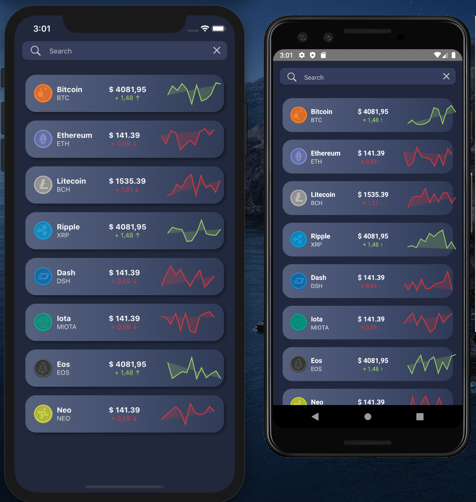

# React Native Dynamic Search Bar Example



Considering that you already have the react-native setup working in your machine (ios/android emulator, nodejs, react-scripts, etc), just follow those simple steps above.

## To run on MacOS iPhone Simulator

To run this example, first install the dependencies:

```
yarn install
```
or
```
npm install
```

And then run:

```
npx react-native start
yarn run ios
```
or
```
npx react-native start
npm run ios
```


### Troubleshooting

If you struggle with errors when trying to run `npm run ios` such as:

```
error Failed to build iOS project. We ran "xcodebuild" command but it exited with error code 65
````
or
```
[!] Unable to find a specification for `boost-for-react-native (= 1.63.0)` depended upon by `React-jsi`
```

Try running on the **ios** folder:

```
cd ios
pod update
pod install
```

Then try again `npm run ios`


## To run on Android Emulator

To run this example, first install the dependencies:

```
yarn install
```
or
```
npm install
```

And then run:

```
npx react-native start
yarn run android
```
or
```
npx react-native start
npm run android
```
